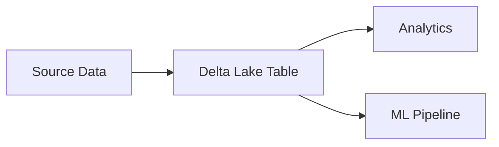

# Contributing to Delta Lake & Apache Iceberg Knowledge Hub

Thank you for your interest in contributing to our community-driven knowledge hub! We welcome contributions of all kinds, from code recipes and documentation to bug fixes and reviews.

## 🌟 Vision

We're building the most comprehensive, up-to-date, and community-validated resource for Delta Lake and Apache Iceberg. Every contribution helps data engineers worldwide make better architectural decisions.

## 🎯 Types of Contributions

### 1. 📝 Documentation Contributions

- **Feature Comparisons**: Enhance our comparison matrices with real-world insights
- **Tutorials**: Create step-by-step guides for common use cases
- **Best Practices**: Share patterns that have worked in production
- **Architecture Patterns**: Document reference architectures

### 2. 💻 Code Recipe Contributions

- **New Recipes**: Share solutions to common problems
- **Recipe Improvements**: Enhance existing recipes with better approaches
- **Bug Fixes**: Fix issues in existing code examples
- **Performance Optimizations**: Improve efficiency of existing solutions

### 3. 🔍 Review Contributions

- **Code Reviews**: Review pull requests from other contributors
- **Documentation Reviews**: Ensure accuracy and clarity
- **Testing**: Validate that recipes work in different environments

### 4. 🐛 Bug Reports and Feature Requests

- **Report Issues**: Help us identify problems
- **Suggest Features**: Propose new sections or capabilities

## 🔄 Contribution Workflow

### Step 1: Fork and Clone

```bash
# Fork the repository on GitHub, then clone your fork
git clone https://github.com/YOUR_USERNAME/Datalake-Guide.git
cd Datalake-Guide

# Add upstream remote
git remote add upstream https://github.com/Analytical-Guide/Datalake-Guide.git
```

### Step 2: Create a Branch

```bash
# Update your main branch
git checkout main
git pull upstream main

# Create a feature branch
git checkout -b feature/your-feature-name
```

### Step 3: Make Your Changes

Follow our style guides and templates (see below).

### Step 4: Test Your Changes

- For code recipes: Run the `validate.sh` script
- For documentation: Check for broken links and spelling
- Run linters as appropriate

### Step 5: Commit with Sign-off

We require a Developer Certificate of Origin (DCO) sign-off for all commits:

```bash
git add .
git commit -s -m "Add feature: description of your changes"
```

The `-s` flag adds a sign-off line: `Signed-off-by: Your Name <your.email@example.com>`

### Step 6: Push and Create Pull Request

```bash
git push origin feature/your-feature-name
```

Then create a pull request on GitHub with:
- Clear title describing the change
- Detailed description of what and why
- Reference any related issues

### Step 7: Address Review Feedback

- Respond to reviewer comments
- Make requested changes
- Push additional commits to your branch

## 📋 Code Recipe Template

All code recipes must follow this structure:

```
code-recipes/
  category/
    recipe-name/
      ├── problem.md          # Problem description
      ├── solution.py         # Fully commented solution
      ├── solution.sql        # (Optional) SQL version
      ├── requirements.txt    # Python dependencies
      ├── environment.yml     # (Optional) Conda environment
      ├── validate.sh         # Validation script
      └── README.md           # Recipe overview
```

### problem.md Template

```markdown
# Problem: [Brief Title]

## Use Case
Describe the real-world scenario where this solution applies.

## Context
Provide background information about the problem.

## Requirements
- Requirement 1
- Requirement 2

## Expected Outcome
What should happen after applying this solution?
```

### solution.py Template

```python
"""
Recipe: [Recipe Name]
Purpose: [Brief description]
Author: [Your Name]
Date: [YYYY-MM-DD]
"""

# Import statements with comments explaining why each is needed
import delta
import pyarrow

def main():
    """
    Main function demonstrating the solution.
    
    Steps:
    1. Step one
    2. Step two
    3. Step three
    """
    # Implementation with clear comments
    pass

if __name__ == "__main__":
    main()
```

### validate.sh Template

```bash
#!/bin/bash
# Validation script for [Recipe Name]

set -e  # Exit on error

echo "Setting up environment..."
# Setup steps

echo "Running solution..."
python solution.py

echo "Validating output..."
# Validation checks

echo "✅ Validation successful!"
```

## 🎨 Style Guides

### Markdown Style

We use [markdownlint](https://github.com/DavidAnson/markdownlint) with the following key rules:

- Use ATX-style headers (`#` syntax)
- One top-level header per file
- Use fenced code blocks with language specifiers
- Blank lines around lists and code blocks
- Line length limit: 120 characters (flexible for links)

### Python Style

We follow [PEP 8](https://pep8.org/) and use [black](https://github.com/psf/black) for formatting:

```bash
# Format your code
black solution.py

# Check for style issues
flake8 solution.py
```

Key conventions:
- Maximum line length: 88 characters (black default)
- Use type hints for function signatures
- Docstrings for all public functions (Google style)
- Meaningful variable names

### SQL Style

- Keywords in UPPERCASE
- Table/column names in lowercase
- Indent with 2 or 4 spaces consistently
- Use comments to explain complex logic

### Diagrams Style

All diagrams must use [Mermaid.js](https://mermaid.js.org/):

```markdown

```

Benefits:
- Version controlled
- Easy to update
- Renders on GitHub automatically
- Accessible to screen readers

## ✅ Developer Certificate of Origin (DCO)

By contributing to this project, you certify that:

1. The contribution was created in whole or in part by you and you have the right to submit it under the Apache 2.0 license
2. The contribution is based upon previous work that, to the best of your knowledge, is covered under an appropriate open source license
3. You understand and agree that this project and your contributions are public

To certify, add a sign-off line to your commits:

```
Signed-off-by: Your Name <your.email@example.com>
```

Use `git commit -s` to add this automatically.

## 🏆 Gamification and Recognition

We track and celebrate contributions through our gamification system:

### Points System

- **Code Recipe** (Merged PR): 25 points
- **Documentation** (Merged PR): 15 points
- **Bug Fix** (Merged PR): 10 points
- **Code Review** (Approved): 5 points
- **Issue Report** (Validated): 3 points

### Recognition

- **Top Contributors**: Featured on README leaderboard
- **Badges**: Earned for milestones (10 PRs, 50 PRs, etc.)
- **Spotlight**: Outstanding contributions highlighted monthly

## 🚫 What NOT to Contribute

- **Proprietary code**: Don't share code you don't have rights to
- **Large binary files**: Use Git LFS or external hosting
- **Generated files**: Don't commit build artifacts
- **Secrets**: Never commit API keys, passwords, or credentials
- **Incomplete work**: Ensure code recipes are tested and validated

## 📞 Getting Help

- **Questions**: Open a [Discussion](../../discussions)
- **Bugs**: Open an [Issue](../../issues)
- **Security**: Email security concerns to the maintainers

## 🎓 Learning Resources

New to contributing to open source?

- [First Contributions Guide](https://github.com/firstcontributions/first-contributions)
- [How to Write a Git Commit Message](https://chris.beams.io/posts/git-commit/)
- [GitHub Flow](https://guides.github.com/introduction/flow/)

## 📜 Code of Conduct

All contributors must adhere to our [Code of Conduct](CODE_OF_CONDUCT.md). We are committed to providing a welcoming and inclusive environment for everyone.

## 🙏 Thank You!

Every contribution, no matter how small, helps make this knowledge hub more valuable for the entire data engineering community. We appreciate your time and effort!

---

**Questions?** Open a [Discussion](../../discussions) or reach out to the maintainers.
