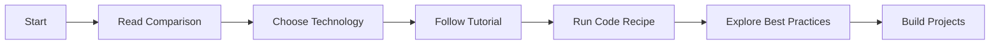

# Quick Start Guide - Delta Lake & Apache Iceberg Knowledge Hub

Welcome to the Delta Lake & Apache Iceberg Knowledge Hub! This guide will help you quickly get started, whether you're here to learn, contribute, or explore.

## 🎯 What is This?

This is a **living, community-driven knowledge ecosystem** for Delta Lake and Apache Iceberg. It's not just documentation—it's a self-sustaining platform with:

- ✅ **Validated Code Recipes**: All examples are CI/CD tested
- ✅ **Automated Freshness**: Stale content is automatically detected
- ✅ **Gamified Contributions**: Earn points and recognition
- ✅ **AI-Powered Curation**: New resources discovered weekly
- ✅ **Comprehensive Comparisons**: Unbiased technical analysis

## 🚀 For Learners

### Start Here

1. **Compare Technologies**: [Feature Comparison Matrix](docs/comparisons/feature-matrix.md)
2. **Get Started**: [Tutorial for Both Technologies](docs/tutorials/getting-started.md)
3. **Try Examples**: 
   - [Delta Lake Basic Example](code-recipes/examples/basic-delta-table/)
   - [Iceberg Basic Example](code-recipes/examples/basic-iceberg-table/)

### Learning Path



### Running Code Recipes

```bash
# Choose a recipe
cd code-recipes/examples/basic-delta-table/

# Install dependencies
pip install -r requirements.txt

# Run the example
python solution.py

# Validate it works
./validate.sh
```

## 🤝 For Contributors

### Quick Contribution

1. **Fork the repository**
2. **Create a branch**: `git checkout -b feature/my-contribution`
3. **Make your changes**: Follow our [Contributing Guide](CONTRIBUTING.md)
4. **Run validation**: Ensure tests pass
5. **Submit PR**: We'll review and provide feedback

### What Can You Contribute?

- 📝 **Documentation**: Fix errors, add examples, improve clarity
- 💻 **Code Recipes**: Share your solutions to common problems
- 🔍 **Reviews**: Help review others' contributions (5 points!)
- 🐛 **Bug Reports**: Identify issues in content or code

### Contribution Points

| Action | Points |
|--------|--------|
| Large PR (>500 lines) | 50 |
| Medium PR (100-500 lines) | 25 |
| Small PR (<100 lines) | 10 |
| Code Review (Approved) | 5 |
| Code Review (Changes) | 3 |
| Issue Closed | 3 |
| Discussion Comment | 1 |

## 🎓 For Architects

### Decision Making Resources

**Choosing Between Delta and Iceberg?**

1. Read: [Feature Comparison Matrix](docs/comparisons/feature-matrix.md)
2. Review: [Production Readiness Guide](docs/best-practices/production-readiness.md)
3. Consider: Your compute engine, team expertise, and requirements

**Key Decision Factors:**

```yaml
Use Delta Lake if:
  - Primary engine is Databricks/Spark
  - Need Z-ordering for multi-dimensional clustering
  - Want built-in Change Data Feed (CDC)
  - Need check constraints and data quality

Use Apache Iceberg if:
  - Need multi-engine support (Spark, Flink, Trino)
  - Want vendor independence
  - Need hidden partitioning
  - Require partition evolution without data rewrite
```

### Architecture Patterns

- [System Overview](docs/architecture/system-overview.md)
- [Complete Blueprint](docs/BLUEPRINT.md)

## 📖 Repository Structure

```
Datalake-Guide/
├── README.md               # Project overview with leaderboard
├── CONTRIBUTING.md         # How to contribute
├── QUICKSTART.md          # This file
├── CODE_OF_CONDUCT.md     # Community standards
├── LICENSE                # Apache 2.0
│
├── .github/workflows/     # Automated CI/CD
│   ├── ci-code-recipes.yml
│   ├── ci-docs.yml
│   ├── stale-content-bot.yml
│   ├── gamification-engine.yml
│   ├── update-leaderboard.yml
│   └── awesome-list-aggregator.yml
│
├── code-recipes/          # Executable examples
│   ├── RECIPE_TEMPLATE.md
│   └── examples/
│       ├── basic-delta-table/
│       └── basic-iceberg-table/
│
├── docs/                  # Documentation
│   ├── BLUEPRINT.md       # Complete technical blueprint
│   ├── comparisons/       # Delta vs Iceberg
│   ├── tutorials/         # Learning guides
│   ├── best-practices/    # Production patterns
│   ├── architecture/      # System design
│   └── awesome-list.md    # Curated resources
│
├── community/             # Community data
│   ├── contributors.json  # Gamification tracking
│   └── processed_urls.json # Resource tracking
│
└── scripts/               # Automation
    ├── find_stale_docs.py
    ├── update_contributor_stats.py
    ├── generate_leaderboard.py
    └── find_new_articles.py
```

## 🤖 Automation Features

### What Happens Automatically?

1. **Code Validation** (on PR):
   - Lints Python code (black, flake8)
   - Runs validation scripts for recipes
   - Checks markdown formatting
   - Validates links and Mermaid diagrams

2. **Stale Content Detection** (weekly):
   - Scans for docs not updated in 12 months
   - Creates GitHub issues for review
   - Assigns to last committer

3. **Gamification** (on events):
   - Tracks contributions (PRs, reviews, issues)
   - Awards points based on activity
   - Updates contributor statistics

4. **Leaderboard Update** (daily):
   - Generates top 10 contributors
   - Updates README automatically
   - Commits and pushes changes

5. **Resource Aggregation** (weekly):
   - Discovers new articles from RSS feeds
   - Generates AI summaries (if configured)
   - Creates PR with new resources

## 🔧 Development Setup

### Prerequisites

- Python 3.8+
- Git
- (Optional) Java 8 or 11 for Spark examples

### Local Setup

```bash
# Clone the repository
git clone https://github.com/Analytical-Guide/Datalake-Guide.git
cd Datalake-Guide

# Install Python dependencies (for running automation scripts)
pip install -r scripts/requirements.txt  # If this file exists

# Or install individually as needed:
pip install PyGithub feedparser beautifulsoup4 requests python-dateutil
```

### Testing Locally

```bash
# Test a Python script
python scripts/generate_leaderboard.py

# Validate a code recipe
cd code-recipes/examples/basic-delta-table/
./validate.sh

# Check markdown formatting
markdownlint README.md

# Check Python code formatting
black --check .
flake8 .
```

## 🎯 Common Tasks

### I want to...

**Learn the basics**
→ Start with [Getting Started Tutorial](docs/tutorials/getting-started.md)

**Compare Delta vs Iceberg**
→ Read [Feature Comparison Matrix](docs/comparisons/feature-matrix.md)

**See working code**
→ Browse [Code Recipes](code-recipes/examples/)

**Contribute a recipe**
→ Copy [Recipe Template](code-recipes/RECIPE_TEMPLATE.md)

**Fix documentation**
→ Follow [Contributing Guide](CONTRIBUTING.md)

**Report a bug**
→ [Open an issue](https://github.com/Analytical-Guide/Datalake-Guide/issues)

**Ask a question**
→ [Start a discussion](https://github.com/Analytical-Guide/Datalake-Guide/discussions)

**See who's contributing**
→ Check [README leaderboard](README.md#-community-leaderboard)

## 📚 Additional Resources

### Official Documentation

- [Delta Lake Docs](https://docs.delta.io/)
- [Apache Iceberg Docs](https://iceberg.apache.org/)

### Community

- [Delta Lake Slack](https://delta-users.slack.com/)
- [Iceberg Slack](https://apache-iceberg.slack.com/)
- [Repository Discussions](https://github.com/Analytical-Guide/Datalake-Guide/discussions)

### Deep Dives

- [Complete Blueprint](docs/BLUEPRINT.md) - Technical architecture
- [System Overview](docs/architecture/system-overview.md) - Automation workflows
- [Production Guide](docs/best-practices/production-readiness.md) - Best practices

## 💡 Tips

1. **Star this repo** to stay updated
2. **Watch releases** for major updates
3. **Join discussions** to connect with community
4. **Contribute early** to climb the leaderboard
5. **Share your stories** via pull requests

## ❓ Getting Help

- **Questions**: [Open a Discussion](https://github.com/Analytical-Guide/Datalake-Guide/discussions)
- **Bugs**: [Create an Issue](https://github.com/Analytical-Guide/Datalake-Guide/issues)
- **Security**: Contact maintainers directly

## 🏆 Hall of Fame

Check out our top contributors on the [main README](README.md#-community-leaderboard)!

---

**Ready to dive in?** Pick a starting point above and begin your journey! 🚀

**Have questions?** Don't hesitate to ask in [Discussions](https://github.com/Analytical-Guide/Datalake-Guide/discussions).

**Want to contribute?** We'd love your help! See [CONTRIBUTING.md](CONTRIBUTING.md).
