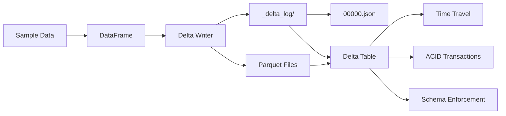

# Basic Delta Table Creation Recipe

## Overview

This recipe demonstrates how to create a basic Delta Lake table from scratch using PySpark. It's the perfect starting point for anyone new to Delta Lake.

## What You'll Learn

- How to configure Spark for Delta Lake
- Creating sample data with proper schema
- Writing data in Delta format
- Reading and querying Delta tables
- Accessing Delta table history (time travel)

## Prerequisites

- Python 3.8 or later
- Basic understanding of Apache Spark
- Familiarity with DataFrames

## Quick Start

```bash
# Install dependencies
pip install -r requirements.txt

# Run the solution
python solution.py

# Validate the recipe
./validate.sh
```

## Recipe Structure

```
basic-delta-table/
├── problem.md         # Detailed problem description
├── solution.py        # Complete, commented solution
├── requirements.txt   # Python dependencies
├── validate.sh        # Automated validation script
└── README.md          # This file
```

## Expected Output

When you run the solution, you'll see:
1. Spark session initialization
2. Sample data creation (5 users)
3. Delta table creation
4. Table statistics and schema
5. Sample data display
6. SQL query demonstration
7. Table history (time travel metadata)

## Key Concepts Demonstrated

### 1. Spark Configuration for Delta Lake

```python
spark = SparkSession.builder \
    .config("spark.sql.extensions", "io.delta.sql.DeltaSparkSessionExtension") \
    .config("spark.sql.catalog.spark_catalog", "org.apache.spark.sql.delta.catalog.DeltaCatalog") \
    .getOrCreate()
```

### 2. Writing Delta Format

```python
df.write \
    .format("delta") \
    .mode("overwrite") \
    .save(table_path)
```

### 3. Reading Delta Tables

```python
df = spark.read.format("delta").load(table_path)
```

### 4. Accessing Table History

```python
spark.sql(f"DESCRIBE HISTORY delta.`{table_path}`")
```

## Validation

The `validate.sh` script automatically:
- Checks Python installation
- Installs dependencies if needed
- Runs the solution
- Verifies Delta table structure
- Confirms transaction log creation
- Reports success/failure

## Architecture Diagram



## Next Steps

After mastering this basic recipe, explore:

1. **Updates and Deletes**: Learn MERGE operations
2. **Time Travel**: Query historical versions
3. **Partitioning**: Improve query performance
4. **Optimization**: Use OPTIMIZE and Z-ORDER
5. **Change Data Feed**: Enable CDC capabilities
6. **Concurrent Writes**: Handle multi-writer scenarios

## Common Issues

### Issue: PySpark not found
**Solution**: `pip install pyspark delta-spark`

### Issue: Java not installed
**Solution**: Install Java 8 or 11 (required by Spark)

### Issue: Permission denied on validate.sh
**Solution**: `chmod +x validate.sh`

## Contributing

Found a bug or have an improvement? Please:
1. Open an issue describing the problem
2. Submit a PR with your fix
3. Ensure validation passes

## References

- [Delta Lake Documentation](https://docs.delta.io/)
- [PySpark API Reference](https://spark.apache.org/docs/latest/api/python/)
- [Delta Lake GitHub](https://github.com/delta-io/delta)

## License

This recipe is part of the Delta Lake & Apache Iceberg Knowledge Hub, licensed under Apache 2.0.
