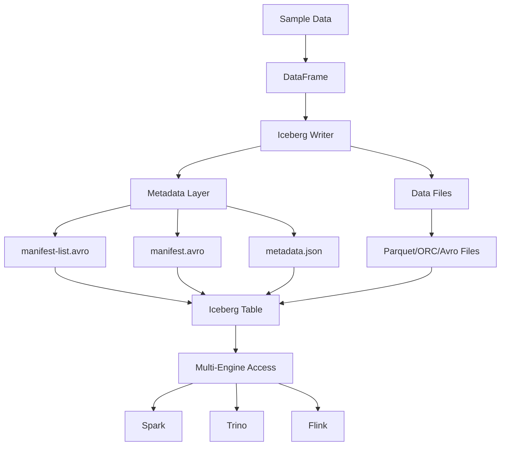

# Basic Apache Iceberg Table Creation Recipe

## Overview

This recipe demonstrates how to create a basic Apache Iceberg table from scratch using PySpark. It showcases Iceberg's key differentiators like hidden partitioning and multi-catalog support.

## What You'll Learn

- How to configure Spark for Iceberg
- Creating tables with Iceberg catalog
- Reading and querying Iceberg tables
- Understanding Iceberg's snapshot system
- Working with hidden partitioning

## Prerequisites

- Python 3.8 or later
- Apache Spark 3.3 or later
- Basic understanding of Apache Spark
- Familiarity with DataFrames

## Quick Start

```bash
# Install dependencies
pip install -r requirements.txt

# Download Iceberg Spark Runtime (if not already available)
# Version should match your Spark version
# Example for Spark 3.3:
# wget https://repo1.maven.org/maven2/org/apache/iceberg/iceberg-spark-runtime-3.3_2.12/1.4.0/iceberg-spark-runtime-3.3_2.12-1.4.0.jar

# Run the solution
python solution.py

# Validate the recipe
./validate.sh
```

## Recipe Structure

```
basic-iceberg-table/
├── problem.md         # Detailed problem description
├── solution.py        # Complete, commented solution
├── requirements.txt   # Python dependencies
├── validate.sh        # Automated validation script
└── README.md          # This file
```

## Expected Output

When you run the solution, you'll see:
1. Spark session initialization with Iceberg configuration
2. Sample data creation (5 users)
3. Iceberg table creation with catalog
4. Table statistics and schema
5. SQL query demonstration
6. Snapshot metadata display
7. Hidden partitioning example

## Key Concepts Demonstrated

### 1. Iceberg Catalog Configuration

```python
spark = SparkSession.builder \
    .config("spark.sql.extensions", "org.apache.iceberg.spark.extensions.IcebergSparkSessionExtensions") \
    .config("spark.sql.catalog.local", "org.apache.iceberg.spark.SparkCatalog") \
    .config("spark.sql.catalog.local.type", "hadoop") \
    .config("spark.sql.catalog.local.warehouse", "/tmp/iceberg-warehouse") \
    .getOrCreate()
```

### 2. Creating Iceberg Tables

```python
# Using writeTo API (Iceberg-specific)
df.writeTo("local.db.users").create()

# Using SQL
spark.sql("""
    CREATE TABLE local.db.users (
        user_id INT,
        username STRING,
        email STRING
    ) USING iceberg
""")
```

### 3. Hidden Partitioning

```python
# Partition by day transformation
spark.sql("""
    CREATE TABLE local.db.events (
        event_time TIMESTAMP,
        user_id STRING
    )
    USING iceberg
    PARTITIONED BY (days(event_time))
""")
```

### 4. Accessing Metadata

```python
# View snapshots
spark.sql("SELECT * FROM local.db.users.snapshots").show()

# View files
spark.sql("SELECT * FROM local.db.users.files").show()
```

## Architecture Diagram



## Iceberg vs Delta Comparison

| Feature | Delta Lake | Apache Iceberg (This Recipe) |
|---------|-----------|------------------------------|
| **Catalog** | File-based | Catalog-based (Hive, Nessie, etc.) |
| **Partitioning** | Explicit | Hidden with transforms |
| **Multi-Engine** | Good | Excellent |
| **Metadata** | JSON transaction log | Avro metadata files |

## Advanced Usage

### Using Different Catalogs

```python
# AWS Glue Catalog
.config("spark.sql.catalog.glue", "org.apache.iceberg.spark.SparkCatalog")
.config("spark.sql.catalog.glue.catalog-impl", "org.apache.iceberg.aws.glue.GlueCatalog")
.config("spark.sql.catalog.glue.warehouse", "s3://my-bucket/warehouse")

# Hive Catalog
.config("spark.sql.catalog.hive", "org.apache.iceberg.spark.SparkCatalog")
.config("spark.sql.catalog.hive.type", "hive")
.config("spark.sql.catalog.hive.uri", "thrift://localhost:9083")
```

### Partition Evolution

```python
# Start with one partition strategy
spark.sql("""
    CREATE TABLE local.db.orders (
        order_time TIMESTAMP,
        amount DECIMAL
    )
    USING iceberg
    PARTITIONED BY (days(order_time))
""")

# Later, add another partition field without rewriting data
spark.sql("""
    ALTER TABLE local.db.orders
    ADD PARTITION FIELD bucket(16, order_id)
""")
```

## Validation

The `validate.sh` script automatically:
- Checks Python installation
- Installs dependencies if needed
- Runs the solution
- Verifies Iceberg table structure
- Confirms metadata creation
- Reports success/failure

## Common Issues

### Issue: Iceberg JAR not found

**Solution**: Download and add Iceberg Spark Runtime JAR

```bash
# For Spark 3.3
wget https://repo1.maven.org/maven2/org/apache/iceberg/iceberg-spark-runtime-3.3_2.12/1.4.0/iceberg-spark-runtime-3.3_2.12-1.4.0.jar

# Add to spark-submit
spark-submit --jars iceberg-spark-runtime-3.3_2.12-1.4.0.jar solution.py
```

### Issue: Catalog not configured

**Solution**: Ensure catalog configuration matches your environment

```python
# For local testing, use hadoop catalog
.config("spark.sql.catalog.local.type", "hadoop")

# For production, use appropriate catalog (Hive, Glue, Nessie)
```

### Issue: Table already exists

**Solution**: Use `createOrReplace()` or drop the table first

```python
df.writeTo("local.db.users").createOrReplace()

# Or
spark.sql("DROP TABLE IF EXISTS local.db.users")
```

## Next Steps

After mastering this basic recipe, explore:

1. **Advanced Operations**: MERGE, UPDATE, DELETE
2. **Time Travel**: Query historical snapshots
3. **Partition Evolution**: Change partitioning strategy
4. **Multi-Engine**: Query with Trino, Flink, Dremio
5. **Table Maintenance**: Compaction, snapshot expiration
6. **Catalog Integration**: AWS Glue, Hive Metastore, Nessie

## Contributing

Found a bug or have an improvement? Please:
1. Open an issue describing the problem
2. Submit a PR with your fix
3. Ensure validation passes

## References

- [Apache Iceberg Documentation](https://iceberg.apache.org/docs/latest/)
- [Iceberg Spark Integration](https://iceberg.apache.org/docs/latest/spark-configuration/)
- [Iceberg GitHub](https://github.com/apache/iceberg)

## License

This recipe is part of the Delta Lake & Apache Iceberg Knowledge Hub, licensed under Apache 2.0.
