# Knowledge Hub System Architecture

This document describes the overall architecture of the Delta Lake & Apache Iceberg Knowledge Hub, including its automation systems, workflows, and data flows.

## System Overview

The knowledge hub is a self-sustaining ecosystem built on GitHub, leveraging GitHub Actions for automation and community engagement.

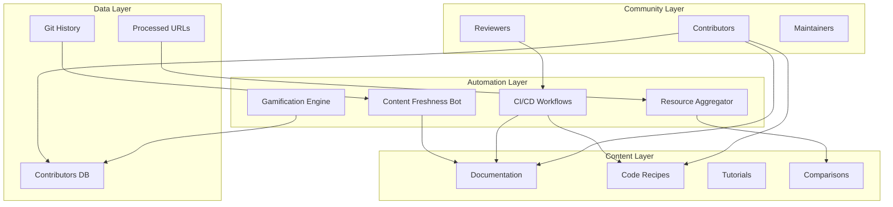

## Workflow Architecture

### 1. Code Recipe Validation Flow

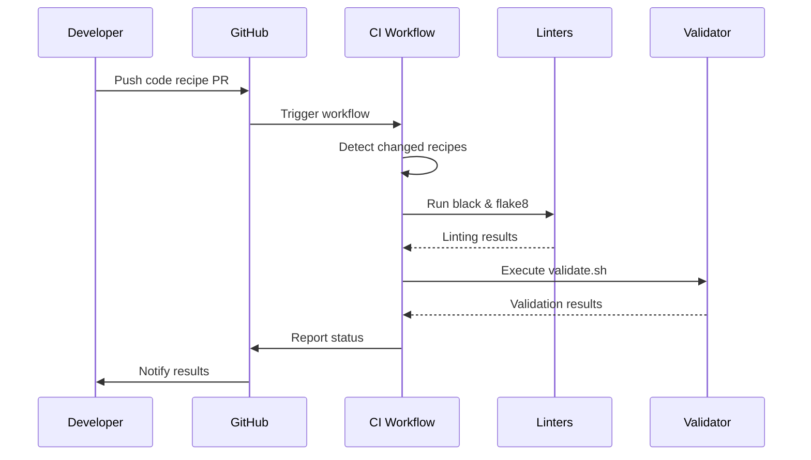

### 2. Documentation Validation Flow

```mermaid
sequenceDiagram
    participant Dev as Developer
    participant GH as GitHub
    participant CI as Doc CI
    participant MD as Markdownlint
    participant Link as Link Checker
    participant Mermaid as Mermaid Validator
    
    Dev->>GH: Push docs PR
    GH->>CI: Trigger workflow
    CI->>MD: Lint markdown
    MD-->>CI: Style results
    CI->>Link: Check links
    Link-->>CI: Link status
    CI->>Mermaid: Validate diagrams
    Mermaid-->>CI: Diagram status
    CI->>GH: Report status
```

### 3. Stale Content Detection Flow

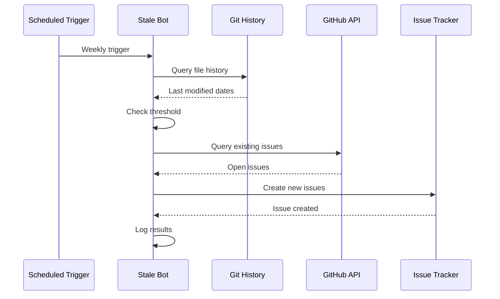

### 4. Gamification Flow

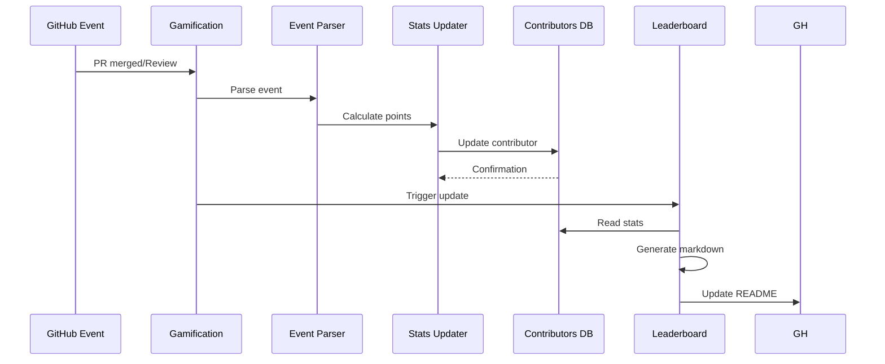

### 5. Resource Aggregation Flow

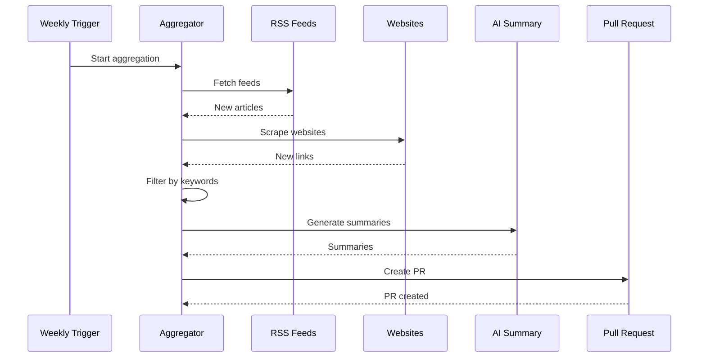

## Component Architecture

### Automation Scripts

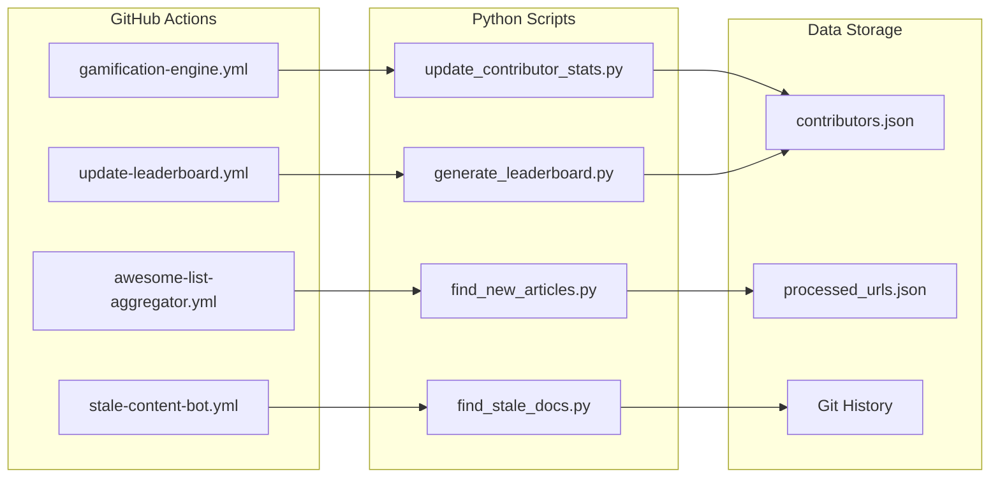

## Data Flow Architecture

### Contributor Points System

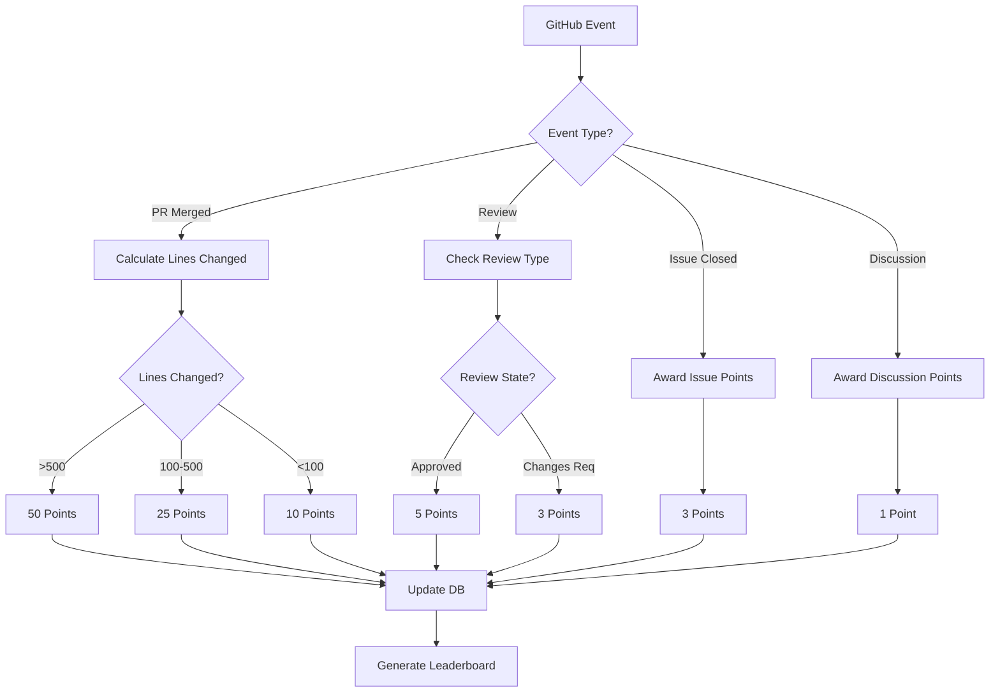

## Deployment Architecture

### GitHub Actions Runtime

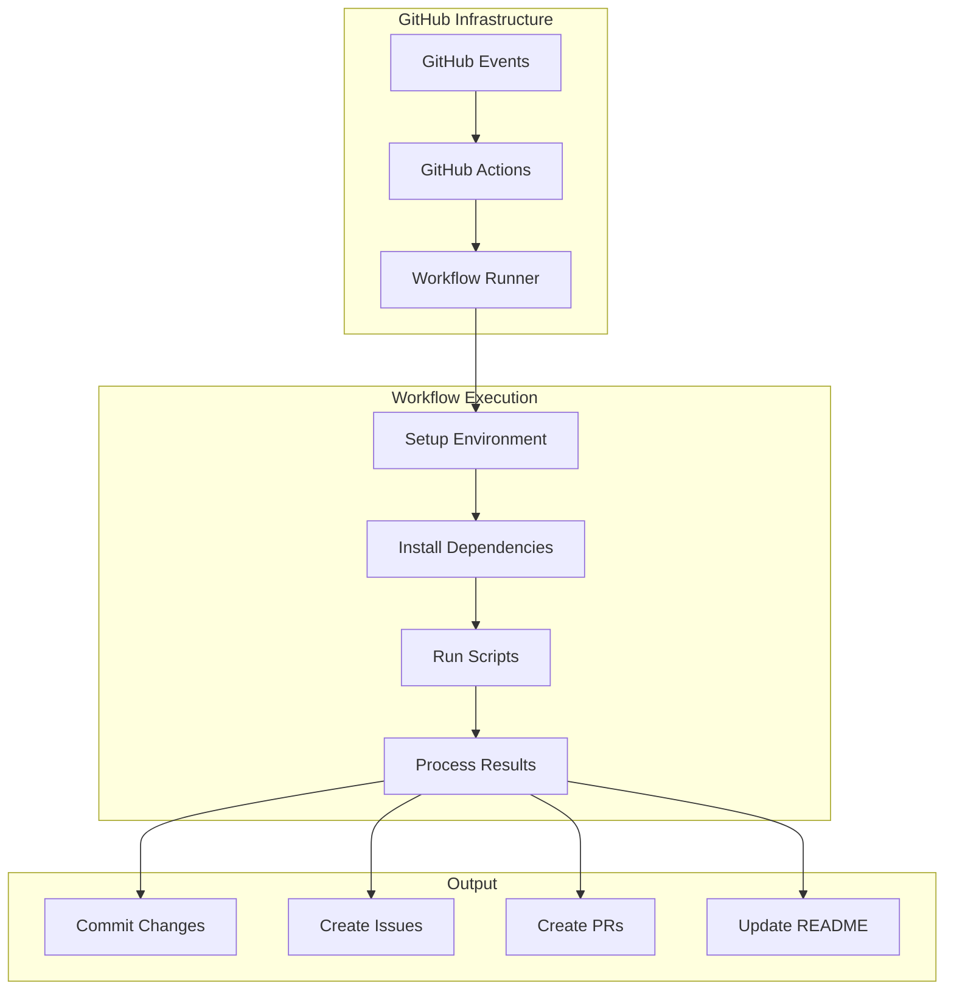

## Security Architecture

### Access Control

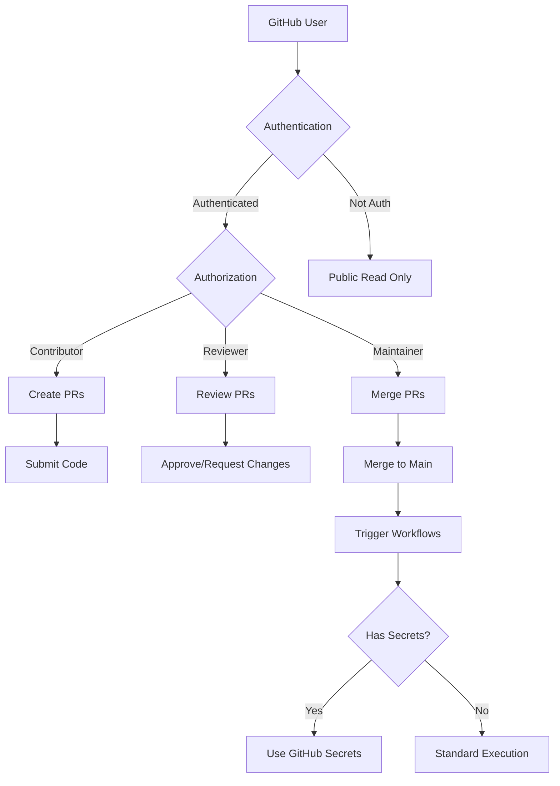

## Scalability Considerations

### Handling Growth

1. **Content Volume**: Git is designed for large repositories
2. **Workflow Executions**: GitHub Actions auto-scales
3. **Community Size**: JSON-based storage for thousands of contributors
4. **Automation Load**: Rate-limited, scheduled jobs

### Performance Optimization

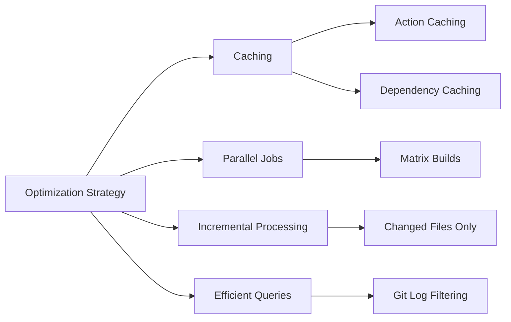

## Monitoring and Observability

### Workflow Monitoring

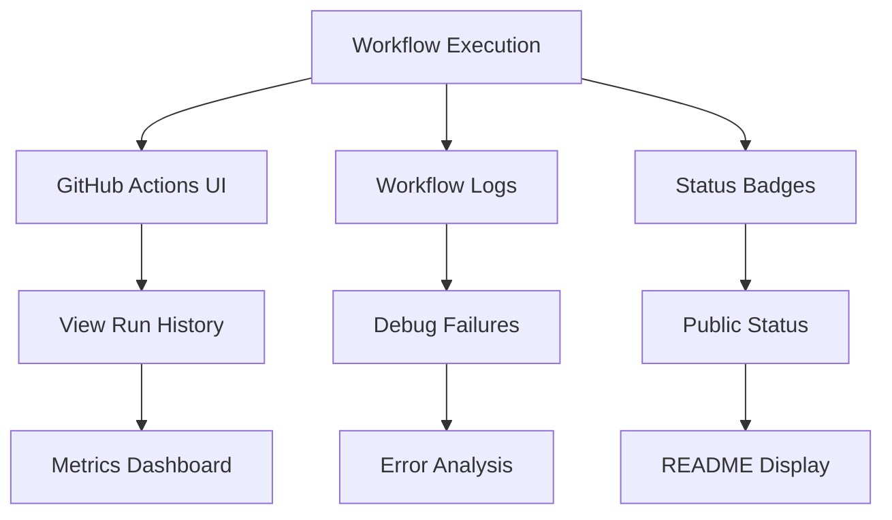

## Future Enhancements

### Planned Architecture Improvements

1. **Advanced AI Integration**: Full LLM API integration for summaries
2. **Real-time Notifications**: Discord/Slack integration
3. **Advanced Analytics**: Contributor insights dashboard
4. **Multi-language Support**: Internationalization
5. **API Gateway**: REST API for programmatic access

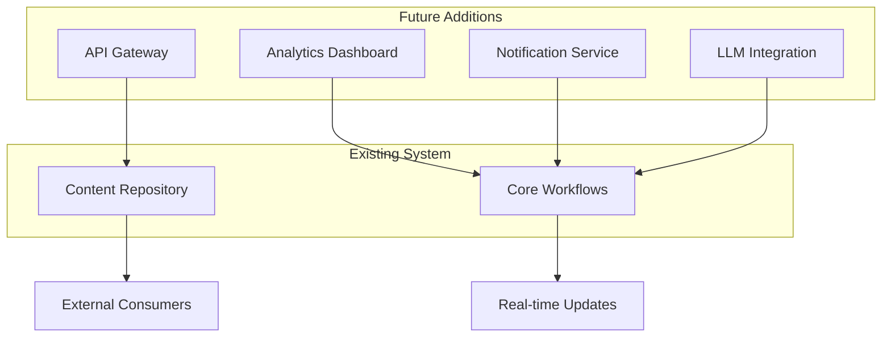

## References

- [GitHub Actions Documentation](https://docs.github.com/en/actions)
- [Mermaid.js Documentation](https://mermaid.js.org/)
- [Python Best Practices](https://docs.python-guide.org/)

---

**Last Updated**: 2025-11-14  
**Maintainers**: Community
