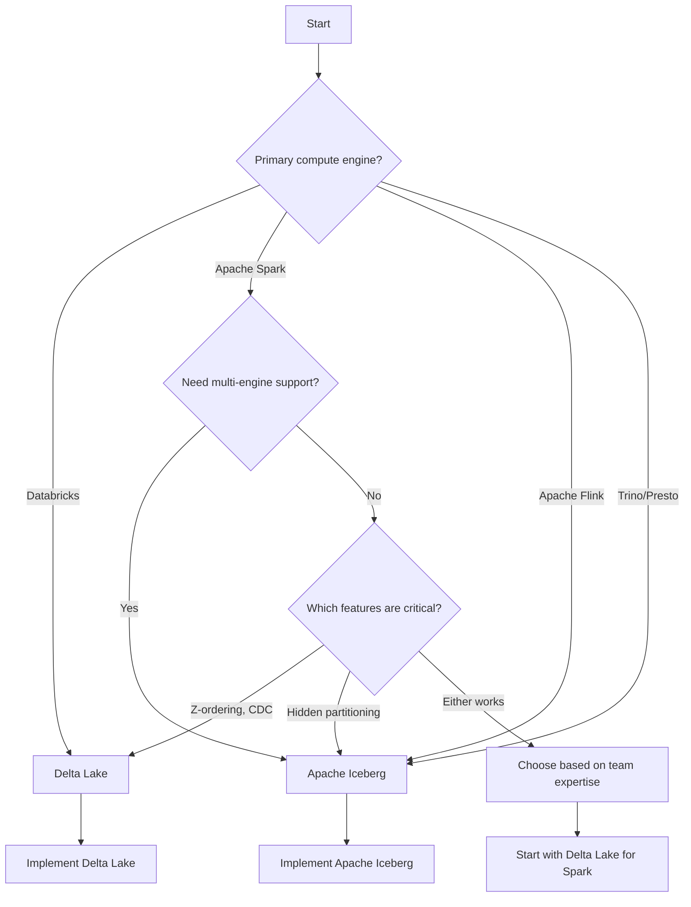

# Getting Started with Delta Lake and Apache Iceberg

This tutorial provides a comprehensive introduction to both Delta Lake and Apache Iceberg, helping you understand when and how to use each technology.

## Overview

Both Delta Lake and Apache Iceberg are open-source table formats that bring ACID transactions, schema evolution, and time travel capabilities to data lakes. They transform collections of Parquet files into reliable, transactional data stores.

## Prerequisites

- Basic understanding of data lakes and Parquet files
- Familiarity with Apache Spark or another query engine
- Access to a development environment (local or cloud)
- Java 8 or 11 installed (for Spark)

## Choosing Between Delta Lake and Iceberg

Use this decision tree to help choose the right technology for your needs:



## Part 1: Delta Lake Quickstart

### Installation

```bash
# Using pip
pip install pyspark delta-spark

# Using conda
conda install -c conda-forge pyspark delta-spark
```

### Your First Delta Table

```python
from pyspark.sql import SparkSession

# Create Spark session with Delta support
spark = SparkSession.builder \
    .appName("DeltaQuickstart") \
    .config("spark.sql.extensions", "io.delta.sql.DeltaSparkSessionExtension") \
    .config("spark.sql.catalog.spark_catalog", "org.apache.spark.sql.delta.catalog.DeltaCatalog") \
    .getOrCreate()

# Create sample data
data = [(1, "Alice", 25), (2, "Bob", 30), (3, "Charlie", 35)]
df = spark.createDataFrame(data, ["id", "name", "age"])

# Write as Delta table
df.write.format("delta").mode("overwrite").save("/tmp/users-delta")

# Read Delta table
delta_df = spark.read.format("delta").load("/tmp/users-delta")
delta_df.show()
```

### Key Delta Lake Operations

#### 1. Update Records

```python
from delta.tables import DeltaTable

delta_table = DeltaTable.forPath(spark, "/tmp/users-delta")

# Update records
delta_table.update(
    condition = "age < 30",
    set = {"age": "age + 1"}
)
```

#### 2. Delete Records

```python
delta_table.delete("id = 2")
```

#### 3. Upsert (MERGE)

```python
# New data
new_data = [(2, "Bob", 31), (4, "Diana", 28)]
new_df = spark.createDataFrame(new_data, ["id", "name", "age"])

# Merge
delta_table.alias("target").merge(
    new_df.alias("source"),
    "target.id = source.id"
).whenMatchedUpdate(set = {
    "name": "source.name",
    "age": "source.age"
}).whenNotMatchedInsert(values = {
    "id": "source.id",
    "name": "source.name",
    "age": "source.age"
}).execute()
```

#### 4. Time Travel

```python
# Query historical version
historical_df = spark.read.format("delta") \
    .option("versionAsOf", 0) \
    .load("/tmp/users-delta")

# Query by timestamp
timestamp_df = spark.read.format("delta") \
    .option("timestampAsOf", "2024-01-01") \
    .load("/tmp/users-delta")

# View history
delta_table.history().show()
```

## Part 2: Apache Iceberg Quickstart

### Installation

```bash
# Using pip
pip install pyspark pyiceberg

# Add Iceberg jars to Spark
# Download from: https://iceberg.apache.org/releases/
```

### Your First Iceberg Table

```python
from pyspark.sql import SparkSession

# Create Spark session with Iceberg support
spark = SparkSession.builder \
    .appName("IcebergQuickstart") \
    .config("spark.sql.extensions", "org.apache.iceberg.spark.extensions.IcebergSparkSessionExtensions") \
    .config("spark.sql.catalog.local", "org.apache.iceberg.spark.SparkCatalog") \
    .config("spark.sql.catalog.local.type", "hadoop") \
    .config("spark.sql.catalog.local.warehouse", "/tmp/warehouse") \
    .getOrCreate()

# Create sample data
data = [(1, "Alice", 25), (2, "Bob", 30), (3, "Charlie", 35)]
df = spark.createDataFrame(data, ["id", "name", "age"])

# Create Iceberg table
df.writeTo("local.db.users").create()

# Read Iceberg table
iceberg_df = spark.table("local.db.users")
iceberg_df.show()
```

### Key Iceberg Operations

#### 1. Update Records

```python
spark.sql("""
    UPDATE local.db.users
    SET age = age + 1
    WHERE age < 30
""")
```

#### 2. Delete Records

```python
spark.sql("DELETE FROM local.db.users WHERE id = 2")
```

#### 3. Upsert (MERGE)

```python
spark.sql("""
    MERGE INTO local.db.users AS target
    USING (
        SELECT 2 AS id, 'Bob' AS name, 31 AS age
        UNION ALL
        SELECT 4 AS id, 'Diana' AS name, 28 AS age
    ) AS source
    ON target.id = source.id
    WHEN MATCHED THEN UPDATE SET *
    WHEN NOT MATCHED THEN INSERT *
""")
```

#### 4. Time Travel

```python
# Query by snapshot ID
historical_df = spark.read \
    .option("snapshot-id", "1234567890") \
    .table("local.db.users")

# Query by timestamp
timestamp_df = spark.read \
    .option("as-of-timestamp", "1672531200000") \
    .table("local.db.users")

# View history
spark.sql("SELECT * FROM local.db.users.history").show()
```

## Common Patterns

### Pattern 1: Incremental Data Loading

#### Delta Lake

```python
from delta.tables import DeltaTable

# Read new data
new_data = spark.read.parquet("s3://bucket/new-data/")

# Append to Delta table
new_data.write.format("delta").mode("append").save("/path/to/delta")
```

#### Iceberg

```python
# Read new data
new_data = spark.read.parquet("s3://bucket/new-data/")

# Append to Iceberg table
new_data.writeTo("local.db.users").append()
```

### Pattern 2: Change Data Capture (CDC)

#### Delta Lake (Built-in CDC)

```python
# Enable CDC
spark.sql("ALTER TABLE delta.`/path/to/table` SET TBLPROPERTIES (delta.enableChangeDataFeed = true)")

# Read changes between versions
changes = spark.read.format("delta") \
    .option("readChangeFeed", "true") \
    .option("startingVersion", 1) \
    .option("endingVersion", 3) \
    .load("/path/to/table")

changes.show()
```

#### Iceberg (Query-based CDC)

```python
# Query changes between snapshots
spark.sql("""
    SELECT * 
    FROM local.db.users.changes
    WHERE snapshot_id > 1234567890
""")
```

### Pattern 3: Data Compaction

#### Delta Lake

```python
# Optimize table
spark.sql("OPTIMIZE delta.`/path/to/table`")

# Z-order by frequently queried columns
spark.sql("OPTIMIZE delta.`/path/to/table` ZORDER BY (date, user_id)")

# Clean up old files
spark.sql("VACUUM delta.`/path/to/table` RETAIN 168 HOURS")
```

#### Iceberg

```python
from pyspark.sql.functions import col
from org.apache.iceberg.actions import Actions

# Rewrite small files
actions = Actions.forTable(spark, "local.db.users")
actions.rewriteDataFiles() \
    .option("target-file-size-bytes", "134217728") \
    .execute()

# Expire old snapshots
actions.expireSnapshots() \
    .expireOlderThan(System.currentTimeMillis() - 7 * 24 * 60 * 60 * 1000) \
    .execute()
```

## Performance Best Practices

### For Both Technologies

1. **Partition Wisely**: Choose partition columns based on query patterns
2. **Monitor Small Files**: Compact regularly to avoid performance degradation
3. **Use Statistics**: Both formats collect statistics; leverage them in queries
4. **Enable Caching**: Cache frequently accessed data
5. **Optimize Schema**: Use appropriate data types

### Delta Lake Specific

1. **Use Z-Ordering**: For multi-dimensional queries
2. **Enable Auto-Optimize**: In Databricks environments
3. **Leverage Data Skipping**: Ensure proper statistics collection
4. **Enable CDC**: Only when needed (adds overhead)

### Iceberg Specific

1. **Use Hidden Partitioning**: Avoid partition pruning issues
2. **Configure Snapshot Retention**: Balance history vs. storage
3. **Optimize Metadata**: Use table properties effectively
4. **Choose Write Mode**: Copy-on-Write vs. Merge-on-Read

## Troubleshooting

### Common Issues

#### Issue: "Delta table not found"

**Solution**: Ensure Delta Lake extensions are configured in SparkSession

```python
.config("spark.sql.extensions", "io.delta.sql.DeltaSparkSessionExtension")
.config("spark.sql.catalog.spark_catalog", "org.apache.spark.sql.delta.catalog.DeltaCatalog")
```

#### Issue: "Iceberg table already exists"

**Solution**: Use `createOrReplace()` or check if table exists first

```python
df.writeTo("local.db.users").createOrReplace()
```

#### Issue: Slow queries

**Solution**: Check partitioning and run compaction

```python
# Delta
spark.sql("OPTIMIZE table_name")

# Iceberg
actions.rewriteDataFiles().execute()
```

## Next Steps

After completing this tutorial, explore:

1. **Advanced Features**:
    - [Advanced Schema Evolution Recipe]({{ '/code-recipes/examples/advanced-schema-evolution/' | relative_url }})
    - [Time Travel Deep Dive](https://docs.delta.io/latest/delta-utility.html#time-travel)
    - [Concurrency Control](https://docs.delta.io/latest/delta-concurrency-control.html)

2. **Production Patterns**:
    - [System Architecture Overview]({{ '/docs/architecture/system-overview/' | relative_url }})
    - [Production Readiness Checklist]({{ '/docs/best-practices/production-readiness/' | relative_url }})
    - [Knowledge Hub Blueprint]({{ '/docs/blueprint/' | relative_url }})

3. **Hands-on Practice**:
    - Browse the [Code Recipes Collection]({{ '/code-recipes/' | relative_url }})
    - Try the [Streaming CDC Pipeline]({{ '/code-recipes/examples/streaming-cdc-pipeline/' | relative_url }})
    - Explore [Time Series Forecasting]({{ '/code-recipes/examples/time-series-forecasting/' | relative_url }})

## Resources

### Documentation
- [Delta Lake Docs](https://docs.delta.io/)
- [Apache Iceberg Docs](https://iceberg.apache.org/docs/latest/)

### Community
- [Delta Lake Slack](https://delta-users.slack.com/)
- [Iceberg Slack](https://apache-iceberg.slack.com/)

### Learning
- [Databricks Academy](https://academy.databricks.com/)
- [Apache Iceberg Tutorials](https://iceberg.apache.org/docs/latest/spark-getting-started/)

## Contributing

Found an issue or have improvements? See our [Contributing Guide](../../CONTRIBUTING.md)!

---

**Last Updated**: 2025-11-14  
**Maintainers**: Community
